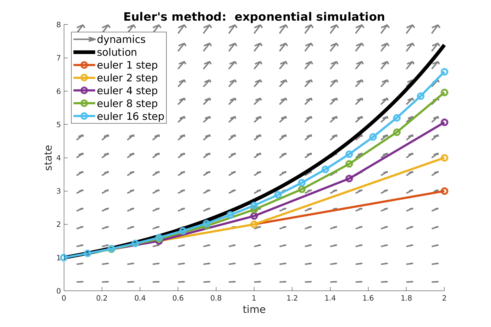
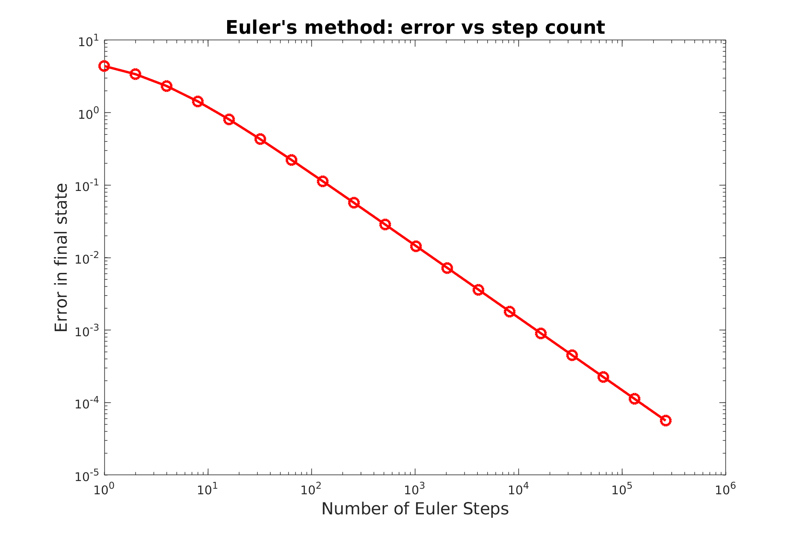
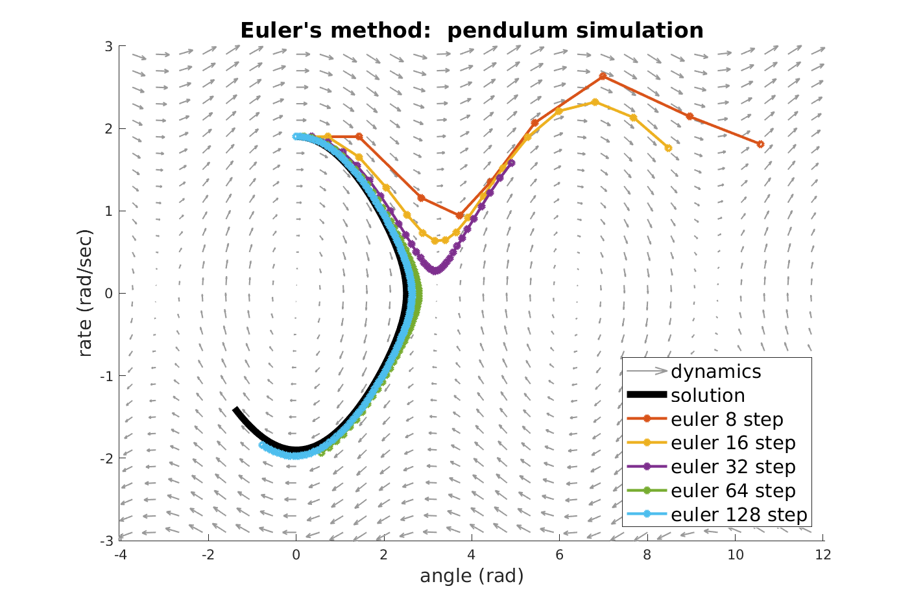

# Lecture 02: Simulation Basics

In this lecture we will introduce Euler's method.
We will cover an intuitive and mathematical derivation,
as well as a discussion of the drawbacks of the method.
Finally, we will dive into some Matlab code and look at how to implement
Euler's method and how to use anonymous functions.

## A simple example: ball traveling through space in one-dimension
- constant velocity (`v`), solve integral to find `x(t)`:
`x(t) = v*t + c;`
- discrete time-stepping:
`x(k) = x(k*h);    h = t(k+1) - t(k);`
- what if velocity is not constant?

## Non-constant velocity (one-dimensional ball through space)
- approximate the motion as constant velocity for a short duration `h`
- the position is then:
`x(t+h) = x(t) + h * v(t) + {higher-order terms  --> 0}`
- in discrete notation:
`x(k+1) = x(k) + h * v(k)`
- let `dx = dx/dt = v` = time-derivative of position
`x(k+1) = x(k) + h * dx(k)     <-- Euler's method!`

## First-order nonlinear system:
- `dx(t) = f(t, x(t))`
- find `x(t)` given `x(0)`  (eg. solve differential equation)
  - `dx(t) = g(t)   <--  directly integrable == EASY`
  - `dx(t) = f(t, x(t))   <--  general nonlinear == HARD`
- often no analytic solution: need to solve numerically
  - many methods, of which Euler's method is the simplest

## Euler's method, the (more) formal way:
1. Linearize the dynamics at the current state
  - taylor expansion, truncated at first order
2. March forward in time
  - estimate state at next time step using taylor expansion
3. Iterate
  - go back to (1), but use the most recent state

## Aside: implicit vs explicit methods
- Euler's method is explicit: next state depends only on previous state
- Implicit methods (much fancier) rely on the next state to compute the next state
  - require a root-solve, but are often more stable (and sometimes more accurate)

## Example: simulate a simple exponential
- Euler's method to solve `dx = x`
- Analytic solution: `x(t) = exp(t)`
  - Easy to verify by direct substitution
  - Initial condition: `x(0) = 1`

**Figure:** Euler's method to simulate an exponential with various step sizes
- smaller step size = more accurate
- visualize the constant-velocity assumption using vector field
- what would the step-size vs error curve look like?

**Figure:** Error analysis for Euler's method solution to exponential
- smaller step size = more accurate
- curve becomes linear on a log-log plot
- very expensive to obtain high-accuracy solutions

## Example: simulate a simple pendulum
- `ddq = -sin(q)`
- no analytic solution
  - unless you count Jacobi Elliptic and Jacobi Amplitude functions...
    - which are computed numerically anyway
  - need to use a numerical solution!
- second-order system...
  - Euler's method only works with first-order systems

## First-order form:
- we can convert the second-order differential equation into a set of first-order equations
- let `w = dq`
- rewrite dynamics as coupled first order system:
  - `dq = w`
  - `dw = -sin(q)`
- this trick works in general
  - *eg.* a third-order system becomes a system of three first-order equations

## Euler's method works for vectors!
- Euler's method applies for systems of equations just like it does for scalars!
- Introduce "arrow" notation for vector quantities
- Write down Euler's method for the pendulum:
- `q(k+1) = q(k) + h * w(k)`
- `w(k+1) = w(k) - h * sin(q(k))`

**Figure:** Euler's method to simulate a simple pendulum, various step sizes
- smaller step size = more accurate
- visualize the constant-velocity assumption using vector field
- large errors for small step size
- significant errors, even for smaller step sizes
- "State-Space" plot (rate vs angle) instead of (time vs state)
  - often used for understanding dynamical systems

## Matlab tutorial:

- anonymous functions
  - how to create one
  - how to use one
- Euler's method in one dimension
- Euler's method in two (or more) dimensions
