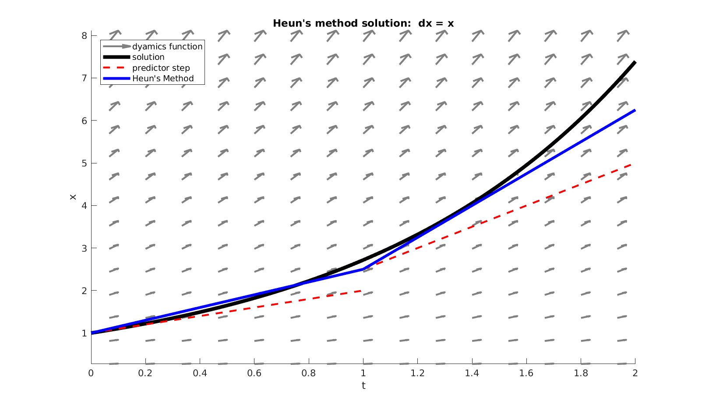

# Lecture: Second-Order Runge--Kutta

This lecture will start with a Matlab coding demo:
starting from scratch use Euler's method to simulate a simple pendulum.
Then break the code into general-purpose functions that make it easy to drop in
a second-order Runge-Kutta method in place of Euler's method, or to compare
them instead. The final part of the lecture will be looking at equations for a
few second-order methods. If there is time then we will work through a derivation
of the family of second-order Runge-Kutta methods.

## Matlab coding demo: pendulum simulation
- write dynamics function
  - start in same script
- write out Euler's method in main script
- show plots of angle and rate vs time
- make Euler's method into a function
- move dynamics function to its own file
- experiment with different simulation parameters
- pull Euler method step into its own function

## Heun's Method:
- second-order explicit Runge--Kutta method
- integration step:
  - predictor step using Euler's method
  - evaluate dynamics at the end of the predictor step
  - estimate dynamics by taking average of the value at the beginning and end of the step
  - take another Euler step from the start of the interal, this time using the better dynamics estimate

**Figure:** Visualization of how Heun's method works to compute a more-accurate solution than would be obtained by Euler's method.

## Two Matlab DEMO's (pre-written):
- `DEMO_HeunMethodVisualization.m`
-  `DEMO_SecondOrderRungeKutta.m`

## Other second order methods?
- There is a family of second-order explicit methods
- Two other common methods:
  - the midpoint method
    - take a half-length Euler step
    - estimate dynamics at end of that step (at midpoint of the interval)
    - take a full-length Euler step from the beginning using the estimate of the dynamics
  - Ralston's method:
    - somewhere between Heun's method and midpoint
    - take two-thirds of an Euler step
    - use a weighted combination of the two dynamics estimate for the corrector step
- There is a general equation for this family of methods:
  - `alpha = ` the fractional length of the first Euler step
  - `w2 = 1 / (2 * alpha) = ` weight on dynamics at the end of the Euler step
  - `w1 = 1 - w2 = `  = weight on the dynamics at the initial point

## Derivation of these equations?
- Based on:
  - reduce the analytic integral to quadrature, with two function evaluations
  - compute the taylor series of the solution to second-order (need the chain rule)
  - set the two expressions equal to each other to compute `w1` and `w2` in terms of `alpha`

## Continue with live-coding demo:
- implement Heun's method step
  - show how to easily switch methods
- implement a general second-order Runge--Kutta integrator

## More details?
- See the hand-written derivation in this directory:
  `Derivation-Second-Order-Runge-Kutta.pdf`

## If there is time, continue live coding demo:
- Compare Euler's method to second order Runge-Kutta
- Compare both low order methods to ODE45 solution
